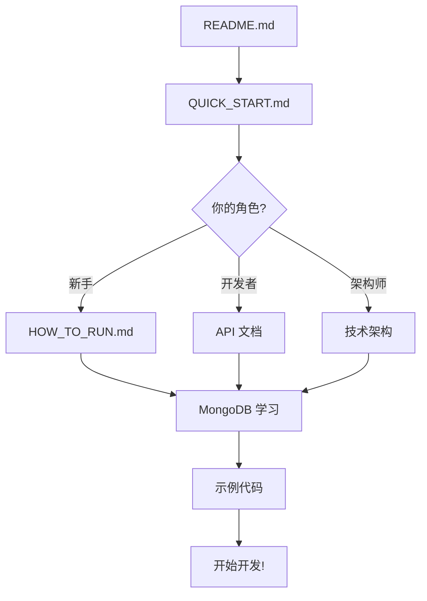

# 📚 完整文档索引

欢迎来到电商订单管理系统的文档中心！本文档将帮助你快速找到所需的资料。

---

## 🚀 我是新手，从这里开始

### 第一次接触项目？

1. **[README.md](README.md)** - 项目总览
2. **[QUICK_START.md](docs/01-getting-started/QUICK_START.md)** - 5 分钟快速上手
3. **[HOW_TO_RUN.md](docs/01-getting-started/HOW_TO_RUN.md)** - 如何运行项目

### 遇到问题？

- **[TROUBLESHOOTING.md](docs/05-troubleshooting/TROUBLESHOOTING.md)** - 常见问题解决

---

## 📂 文档目录结构

```
docs/
├── 01-getting-started/      🚀 入门指南
├── 02-development/          🔨 开发进度和学习笔记
├── 03-testing/              🧪 测试相关
├── 04-debugging/            🐛 调试技巧
├── 05-troubleshooting/      ❓ 问题排查
├── 06-api-design/           📐 API 设计和架构
└── 07-mongodb-learning/     📚 MongoDB 学习资料

examples/                     💻 示例代码
```

---

## 📑 按主题查找文档

### 🚀 入门和启动

| 文档 | 描述 | 时间 |
|------|------|------|
| [QUICK_START.md](docs/01-getting-started/QUICK_START.md) | 快速开始指南 | 5 分钟 |
| [HOW_TO_RUN.md](docs/01-getting-started/HOW_TO_RUN.md) | 如何运行项目 | 10 分钟 |
| [FRONTEND_SETUP.md](docs/01-getting-started/FRONTEND_SETUP.md) | 前端设置指南 | 5 分钟 |
| [QUICK_START_FRONTEND.md](docs/01-getting-started/QUICK_START_FRONTEND.md) | 前端快速开始 | 5 分钟 |
| [USER_ROLE_QUICK_START.md](docs/01-getting-started/USER_ROLE_QUICK_START.md) | 用户角色快速开始 | 5 分钟 |
| [PRODUCT_MANAGEMENT_GUIDE.md](docs/01-getting-started/PRODUCT_MANAGEMENT_GUIDE.md) | 商品管理使用指南 | 15 分钟 |
| [PHASE3_FRONTEND_DEMO_GUIDE.md](docs/01-getting-started/PHASE3_FRONTEND_DEMO_GUIDE.md) | Phase 3 前端 Demo 指南 | 10 分钟 |
| [ORDER_MANAGEMENT_GUIDE.md](docs/01-getting-started/ORDER_MANAGEMENT_GUIDE.md) | 订单管理使用指南 | 15 分钟 |
| [PHASE4_FRONTEND_DEMO_GUIDE.md](docs/01-getting-started/PHASE4_FRONTEND_DEMO_GUIDE.md) | Phase 4 前端 Demo 指南 | 10 分钟 |

**📁 完整目录**: [docs/01-getting-started/](docs/01-getting-started/)

---

### 🔨 开发指南

| 文档 | 描述 | 时间 |
|------|------|------|
| [PHASE1_PROGRESS.md](docs/02-development/PHASE1_PROGRESS.md) | Phase 1 开发进度追踪 | 15 分钟 |
| [PHASE2_PROGRESS.md](docs/02-development/PHASE2_PROGRESS.md) | Phase 2 开发进度追踪 | 15 分钟 |
| [PHASE2_COMPLETE.md](docs/02-development/PHASE2_COMPLETE.md) | Phase 2 完成总结 | 15 分钟 |
| [PHASE3_PROGRESS.md](docs/02-development/PHASE3_PROGRESS.md) | Phase 3 开发进度追踪 | 15 分钟 |
| [PHASE3_COMPLETE.md](docs/02-development/PHASE3_COMPLETE.md) | Phase 3 完成总结 | 15 分钟 |
| [PHASE4_PROGRESS.md](docs/02-development/PHASE4_PROGRESS.md) | Phase 4 开发进度追踪 | 15 分钟 |
| [PHASE4_COMPLETE.md](docs/02-development/PHASE4_COMPLETE.md) | Phase 4 完成总结 | 15 分钟 |
| [DAY1_SUMMARY.md](docs/02-development/DAY1_SUMMARY.md) | Day 1 开发总结 | 10 分钟 |
| [DAY2-3_COMPLETE.md](docs/02-development/DAY2-3_COMPLETE.md) | Day 2-3 完成报告 | 15 分钟 |
| [DAY2-3_LEARNING_GUIDE.md](docs/02-development/DAY2-3_LEARNING_GUIDE.md) | Day 2-3 学习指南 | 20 分钟 |
| [DAY4-5_COMPLETE.md](docs/02-development/DAY4-5_COMPLETE.md) | Day 4-5 完成报告 | 15 分钟 |
| [PRODUCT_DEMO_ENHANCEMENT_SUMMARY.md](docs/02-development/PRODUCT_DEMO_ENHANCEMENT_SUMMARY.md) | 商品管理 Demo 增强总结 | 10 分钟 |
| [PHASE4_FRONTEND_DEMO_SUMMARY.md](docs/02-development/PHASE4_FRONTEND_DEMO_SUMMARY.md) | Phase 4 前端 Demo 总结 | 10 分钟 |
| [USER_ROLE_UPDATE_SUMMARY.md](docs/02-development/USER_ROLE_UPDATE_SUMMARY.md) | 用户角色系统更新总结 | 10 分钟 |
| [USER_ROLE_REGISTRATION.md](docs/02-development/USER_ROLE_REGISTRATION.md) | 用户角色注册说明 | 10 分钟 |
| [AUTH_REFACTORING_SUMMARY.md](docs/02-development/AUTH_REFACTORING_SUMMARY.md) | 认证重构总结 | 15 分钟 |
| [DEPENDENCIES_REFACTORING_SUMMARY.md](docs/02-development/DEPENDENCIES_REFACTORING_SUMMARY.md) | 依赖注入重构总结 | 15 分钟 |
| [ERROR_HANDLING_EXPLAINED.md](docs/02-development/ERROR_HANDLING_EXPLAINED.md) | 错误处理机制说明 | 20 分钟 |
| [EXCEPTION_USAGE_GUIDE.md](docs/02-development/EXCEPTION_USAGE_GUIDE.md) | 异常使用指南 | 15 分钟 |
| [TEST_CORS_GUIDE.md](docs/02-development/TEST_CORS_GUIDE.md) | CORS 测试指南 | 15 分钟 |

**📁 完整目录**: [docs/02-development/](docs/02-development/)

---

### 🧪 测试指南

| 文档 | 描述 | 时间 |
|------|------|------|
| [TESTING_QUICK_START.md](docs/03-testing/TESTING_QUICK_START.md) | 测试快速开始 | 5 分钟 |
| [PYTEST_GUIDE.md](docs/03-testing/PYTEST_GUIDE.md) | Pytest 完整教程 | 30 分钟 |
| [COVERAGE_QUICK_START.md](docs/03-testing/COVERAGE_QUICK_START.md) | 覆盖率快速开始 | 5 分钟 |
| [COVERAGE_GUIDE.md](docs/03-testing/COVERAGE_GUIDE.md) | 覆盖率完整教程 | 20 分钟 |

**📁 完整目录**: [docs/03-testing/](docs/03-testing/)

---

### 🐛 调试技巧

| 文档 | 描述 | 时间 |
|------|------|------|
| [DEBUG_QUICK_START.md](docs/04-debugging/DEBUG_QUICK_START.md) | 调试快速开始 | 5 分钟 |
| [DEBUG_GUIDE.md](docs/04-debugging/DEBUG_GUIDE.md) | 调试完整教程 | 20 分钟 |
| [VSCODE_DEBUG_GUIDE.md](docs/04-debugging/VSCODE_DEBUG_GUIDE.md) | VS Code 调试指南 | 15 分钟 |
| [DEBUG_COMPARISON.md](docs/04-debugging/DEBUG_COMPARISON.md) | 调试方式对比 | 10 分钟 |
| [DEBUG_MODE_READY.md](docs/04-debugging/🎉_DEBUG_MODE_READY.md) | 调试模式说明 | 10 分钟 |

**📁 完整目录**: [docs/04-debugging/](docs/04-debugging/)

---

### ❓ 问题排查

| 文档 | 描述 | 时间 |
|------|------|------|
| [TROUBLESHOOTING.md](docs/05-troubleshooting/TROUBLESHOOTING.md) | 通用故障排除 | 按需 |
| [FIX_MODULE_ERROR.md](docs/05-troubleshooting/❌_FIX_MODULE_ERROR.md) | 模块错误修复 | 按需 |
| [PHASE2_TROUBLESHOOTING.md](docs/05-troubleshooting/PHASE2_TROUBLESHOOTING.md) | Phase 2 故障排除 | 按需 |
| [DEBUG_FAILED_FETCH.md](docs/05-troubleshooting/DEBUG_FAILED_FETCH.md) | Failed to Fetch 错误调试 | 按需 |
| [FIX_ADMIN_EMAIL.md](docs/05-troubleshooting/FIX_ADMIN_EMAIL.md) | 管理员邮箱验证问题 | 按需 |
| [FIX_ROUTE_MATCHING_ISSUE.md](docs/05-troubleshooting/FIX_ROUTE_MATCHING_ISSUE.md) | 路由匹配顺序问题 | 按需 |
| [FIX_USER_ID_FIELD.md](docs/05-troubleshooting/FIX_USER_ID_FIELD.md) | 用户 ID 字段访问问题 | 按需 |
| [FIX_USERINDB_ATTRIBUTE_ERROR.md](docs/05-troubleshooting/FIX_USERINDB_ATTRIBUTE_ERROR.md) | UserInDB 属性错误 | 按需 |
| [FRONTEND_ORDER_FIX.md](docs/05-troubleshooting/FRONTEND_ORDER_FIX.md) | 前端订单验证问题 | 按需 |
| [ORDER_CREATE_EXPLANATION.md](docs/05-troubleshooting/ORDER_CREATE_EXPLANATION.md) | 订单创建代码解析 | 按需 |
| [FINAL_ORDER_FIX_SUMMARY.md](docs/05-troubleshooting/FINAL_ORDER_FIX_SUMMARY.md) | 订单功能修复总结 | 按需 |

**📁 完整目录**: [docs/05-troubleshooting/](docs/05-troubleshooting/)

---

### 📐 API 设计和架构

| 文档 | 描述 | 时间 |
|------|------|------|
| [PROJECT_SUMMARY.md](docs/06-api-design/PROJECT_SUMMARY.md) | 项目总览 | 15 分钟 |
| [ecommerce_project_requirements.md](docs/06-api-design/ecommerce_project_requirements.md) | 项目需求文档 | 20 分钟 |
| [ecommerce_technical_architecture.md](docs/06-api-design/ecommerce_technical_architecture.md) | 技术架构文档 | 30 分钟 |
| [ecommerce_api_documentation.md](docs/06-api-design/ecommerce_api_documentation.md) | API 完整文档 | 40 分钟 |
| [ecommerce_data_model_design.md](docs/06-api-design/ecommerce_data_model_design.md) | 数据模型设计 | 30 分钟 |
| [ecommerce_development_roadmap.md](docs/06-api-design/ecommerce_development_roadmap.md) | 开发路线图 | 25 分钟 |
| [QUICK_REFERENCE.md](docs/06-api-design/QUICK_REFERENCE.md) | 快速参考手册 | 按需 |

**📁 完整目录**: [docs/06-api-design/](docs/06-api-design/)

---

### 📚 MongoDB 学习

| 文档 | 描述 | 时间 |
|------|------|------|
| [mongodb_learning_guide_outline.md](docs/07-mongodb-learning/mongodb_learning_guide_outline.md) | 学习大纲 | 10 分钟 |
| [mongodb_learning_guide.md](docs/07-mongodb-learning/mongodb_learning_guide.md) | 完整学习指南 | 3-5 小时 |

**📁 完整目录**: [docs/07-mongodb-learning/](docs/07-mongodb-learning/)

---

### 💻 示例代码

| 文件 | 描述 | 难度 |
|------|------|------|
| [crud_operations.py](examples/crud_operations.py) | CRUD 操作示例 | ⭐⭐ 入门 |
| [aggregation_pipeline.py](examples/aggregation_pipeline.py) | 聚合管道示例 | ⭐⭐⭐ 进阶 |
| [blog_system.py](examples/blog_system.py) | 博客系统数据模型 | ⭐⭐⭐ 进阶 |
| [ecommerce_system.py](examples/ecommerce_system.py) | 电商系统数据模型 | ⭐⭐⭐⭐ 高级 |

**📁 完整目录**: [examples/](examples/)

---

## 🎯 按角色查找文档

### 👨‍💻 新手开发者

**学习路径：**
```
1. README.md
2. QUICK_START.md
3. HOW_TO_RUN.md
4. PYTEST_GUIDE.md
5. examples/ 中的示例代码
```

---

### 🚀 后端开发者

**核心文档：**
- API 文档: [ecommerce_api_documentation.md](docs/06-api-design/ecommerce_api_documentation.md)
- 数据模型: [ecommerce_data_model_design.md](docs/06-api-design/ecommerce_data_model_design.md)
- 快速参考: [QUICK_REFERENCE.md](docs/06-api-design/QUICK_REFERENCE.md)

---

### 🏗️ 架构师/技术负责人

**核心文档：**
- 项目总览: [PROJECT_SUMMARY.md](docs/06-api-design/PROJECT_SUMMARY.md)
- 技术架构: [ecommerce_technical_architecture.md](docs/06-api-design/ecommerce_technical_architecture.md)
- 开发路线图: [ecommerce_development_roadmap.md](docs/06-api-design/ecommerce_development_roadmap.md)

---

### 🧪 测试工程师

**核心文档：**
- 测试快速开始: [TESTING_QUICK_START.md](docs/03-testing/TESTING_QUICK_START.md)
- Pytest 指南: [PYTEST_GUIDE.md](docs/03-testing/PYTEST_GUIDE.md)
- 覆盖率指南: [COVERAGE_GUIDE.md](docs/03-testing/COVERAGE_GUIDE.md)

---

### 🎓 学习者

**推荐顺序：**
```
Week 1: 入门
├─ QUICK_START.md
├─ HOW_TO_RUN.md
└─ crud_operations.py

Week 2: MongoDB
├─ mongodb_learning_guide.md
├─ aggregation_pipeline.py
└─ blog_system.py

Week 3: 测试
├─ PYTEST_GUIDE.md
├─ COVERAGE_GUIDE.md
└─ 编写测试

Week 4: 调试
├─ DEBUG_GUIDE.md
├─ VSCODE_DEBUG_GUIDE.md
└─ 实践调试

Week 5-6: 项目实战
├─ ecommerce_api_documentation.md
├─ ecommerce_data_model_design.md
└─ 开发实际功能
```

---

## 📊 文档统计

| 类别 | 文档数 | 总字数（预估） |
|------|--------|----------------|
| 入门指南 | 9 | ~20,000 |
| 开发指南 | 19 | ~60,000 |
| 测试指南 | 4 | ~15,000 |
| 调试指南 | 5 | ~20,000 |
| 问题排查 | 11 | ~30,000 |
| API 设计 | 7 | ~50,000 |
| MongoDB 学习 | 2 | ~40,000 |
| 示例代码 | 4 | ~500 行代码 |
| **总计** | **61** | **~235,000 字** |

---

## 🔍 快速搜索

### 我想学习...

- **Python 测试**: → [docs/03-testing/](docs/03-testing/)
- **MongoDB**: → [docs/07-mongodb-learning/](docs/07-mongodb-learning/)
- **VS Code 调试**: → [docs/04-debugging/VSCODE_DEBUG_GUIDE.md](docs/04-debugging/VSCODE_DEBUG_GUIDE.md)
- **API 设计**: → [docs/06-api-design/](docs/06-api-design/)

### 我想知道...

- **如何运行项目**: → [docs/01-getting-started/HOW_TO_RUN.md](docs/01-getting-started/HOW_TO_RUN.md)
- **项目进度**: → [docs/02-development/PHASE1_PROGRESS.md](docs/02-development/PHASE1_PROGRESS.md)
- **API 端点**: → [docs/06-api-design/ecommerce_api_documentation.md](docs/06-api-design/ecommerce_api_documentation.md)
- **数据结构**: → [docs/06-api-design/ecommerce_data_model_design.md](docs/06-api-design/ecommerce_data_model_design.md)

### 我遇到了...

- **启动错误**: → [docs/05-troubleshooting/TROUBLESHOOTING.md](docs/05-troubleshooting/TROUBLESHOOTING.md)
- **模块错误**: → [docs/05-troubleshooting/❌_FIX_MODULE_ERROR.md](docs/05-troubleshooting/❌_FIX_MODULE_ERROR.md)
- **测试失败**: → [docs/03-testing/](docs/03-testing/)

---

## 📝 文档维护

### 文档版本
- **创建日期**: 2025-10-22
- **最后更新**: 2025-11-21
- **当前版本**: v1.2.0

### 贡献指南
- 发现文档错误？请提 Issue
- 想要改进文档？欢迎 Pull Request
- 有建议或问题？在项目中讨论

---

## 🎉 开始你的学习之旅！

**推荐路径：**



**Happy Learning & Coding!** 🚀✨

---

**提示**: 收藏这个页面，方便随时查找文档！

